# Aggiornamento Modifica Robot Brushless

## Descrizione Aggiornamento

Caricato il profilo di stampa per poter montare il nuovo motore per la lama di taglio. Questa volta il motore non è più a spazzole ma **brushless** con una potenza superiore. Ho anche modificato l'albero che rende snodato il robot per agevolare il passaggio dei cavi.

Per il montaggio di questo componente in **acciaio INOX** è necessario allargare il foro di battuta dei cuscinetti del vecchio albero.  
Per chi non vuole allargare il foro, ho caricato anche la **scocca posteriore** con il foro modificato.  
La scocca centrale è modificata per contenere il nuovo motore ed i nuovi componenti di elettronica necessari al funzionamento.  
Per chi non volesse cambiare l'albero snodato in acciaio INOX, le parti restano **compatibili**.

## Installazione Nuovo Albero Snodato
Per chi vuole montare il nuovo albero snodato:
1. Togliere i vecchi cuscinetti.
2. Installare i nuovi mettendo tra un cuscinetto e l'altro uno spessore stretto e uno più largo.
3. In questo modo i 3 cuscinetti occuperanno lo stesso spazio dei vecchi.

---

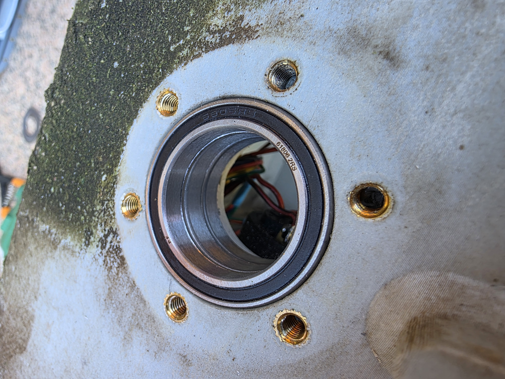

## Materiale Necessario
- **Pz 1** 36V 138W 5.3A 57mm motore DC Brushless  
  [Link al motore](https://it.aliexpress.com/item/1005001921767537.html)
- **Pz 1** Controller BLDC Trifase PWM con Hall  
  [Link al controller](https://it.aliexpress.com/item/1005001738213078.html)
- **Pz 1** Convertitore boost step-up DC 400W 15A  
  [Link allo step-up](https://it.aliexpress.com/item/1005008151824624.html)
- **Pz 1** Calettatore albero-mozzo Ø8 inox  
  [Link al calettatore](https://www.norelem.it/it/...)
- **Pz 3** Cuscinetto 6806-2RS 42x30x7  
  [Link ai cuscinetti](https://it.aliexpress.com/item/1005009118427980.html)
- **Pz 6** Viti M3x12 inox
- **Pz 4** Viti M4x10 inox
- **Pz 6** Bussole ottone viti M3
- **Pz 4** Bussole ottone viti M4
- **Pz 1** Ghiera M30x1.5 autobloccante  
  [Link alla ghiera](https://it.aliexpress.com/item/1005006041747865.html)

---

## Montaggio Meccanico

Successivamente va montato la nuova flangia di chiusura per il nuovo albero. Mi raccomando di ingrassare il tutto prima di inserirlo.  

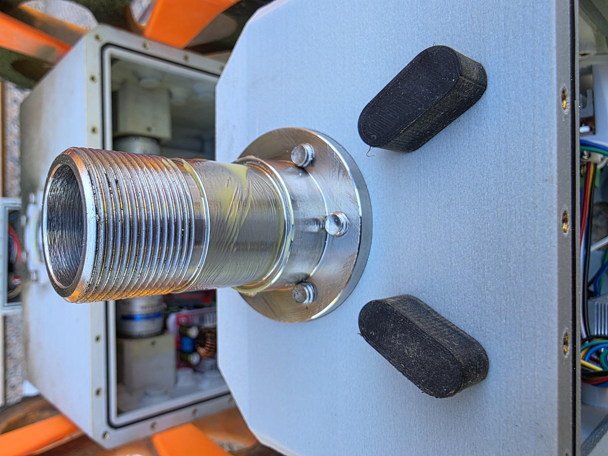  
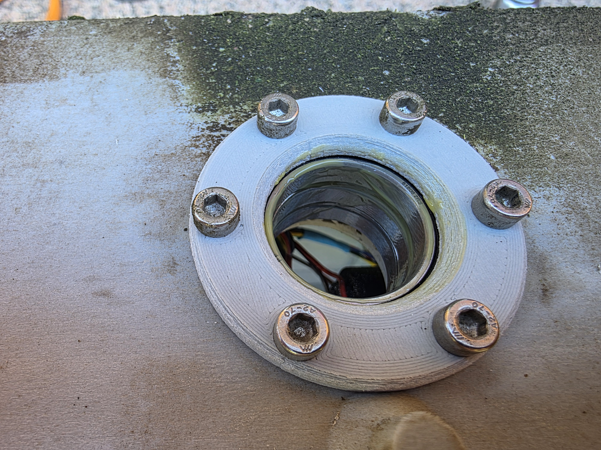

Poi inserendo il nuovo albero va messo il distanziale e poi la ghiera di bloccaggio per fare il pacco dei cuscinetti e bloccare il tutto. Io avendo la possibilità ho fatto le parti in metallo ma ho caricato i profili di stampa per realizzarli in PETG-CF con riempimento del 100%. Io ho usato 2 ghiere perché non avevo la versione autobloccante ma volendo ne basta una l'importante è che sia autobloccante.  

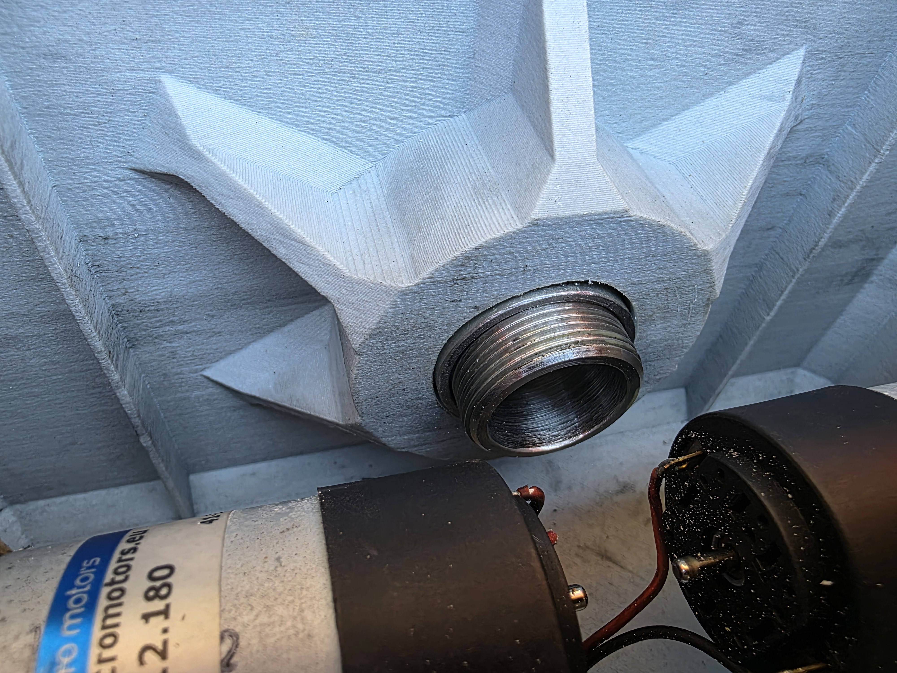  
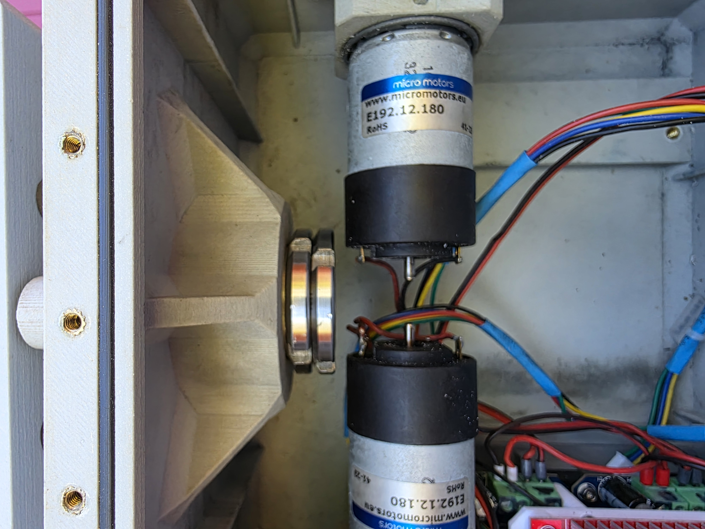

A questo punto si può avvitare il nuovo albero alla scocca centrale.  

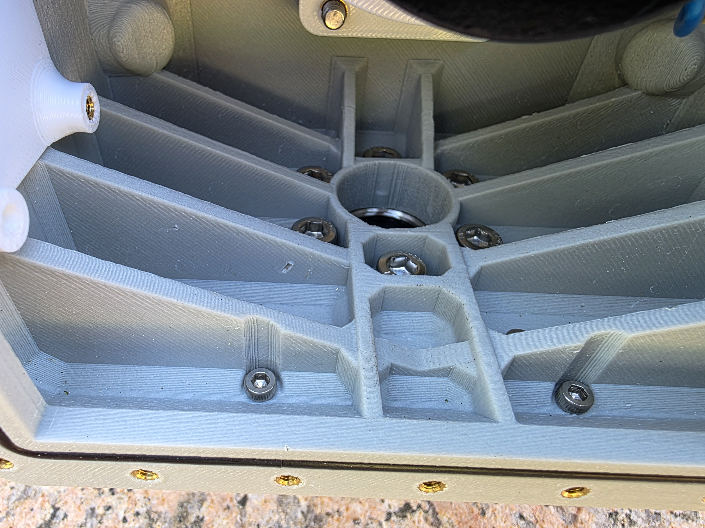

Poi va montato il driver del motore sul relativo supporto, preparato il cablaggio su di esso e poi inserito nella scocca. Va avvitato sul suo supporto con viti M3 e dadi tra la scheda e il dissipatore. Per inserirlo nel supporto lo si fa scorrere infilandolo da un lato corto.  

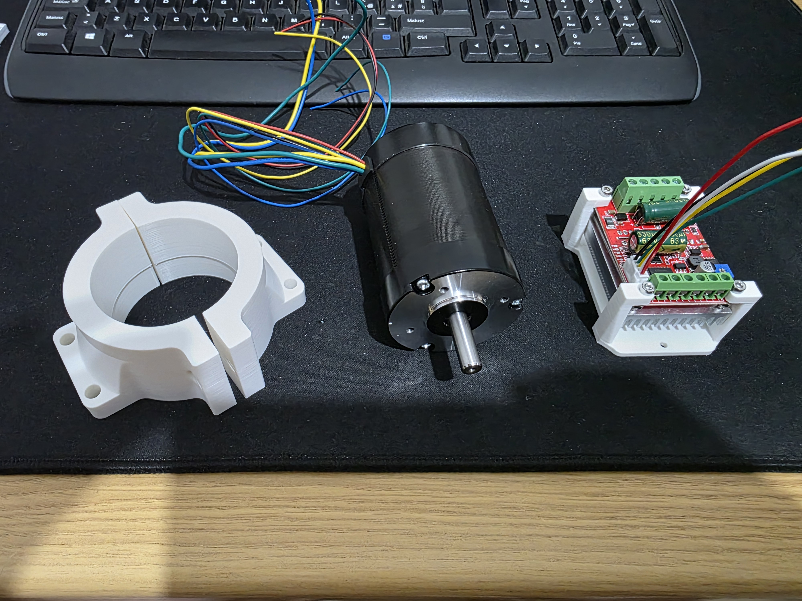

Sul driver va saldato un cavo sul foro contrassegnato come P: PWM che va collegato al pin: RPWM del pcb, ponticellato le piazzole di fianco il condensatore e poi collegato i fili dei sensori di hall del motore ai fili forniti col driver rispettando le fasi A-B-C del motore e 5v e gnd.  
Va poi collegato il pin della morsettiera contrassegnato come STOP al pin R_EN del pcb, il pin della morsettiera contrassegnato come DIR al pin L_EN del pcb e il pin della morsettiera contrassegnato come GND al GND del pcb che distribuisce le alimentazioni 5v. Nella morsettiera grande (quella con 5 ingressi) va inserito la fasi del motore e l'alimentazione che proviene dallo Step-up.  

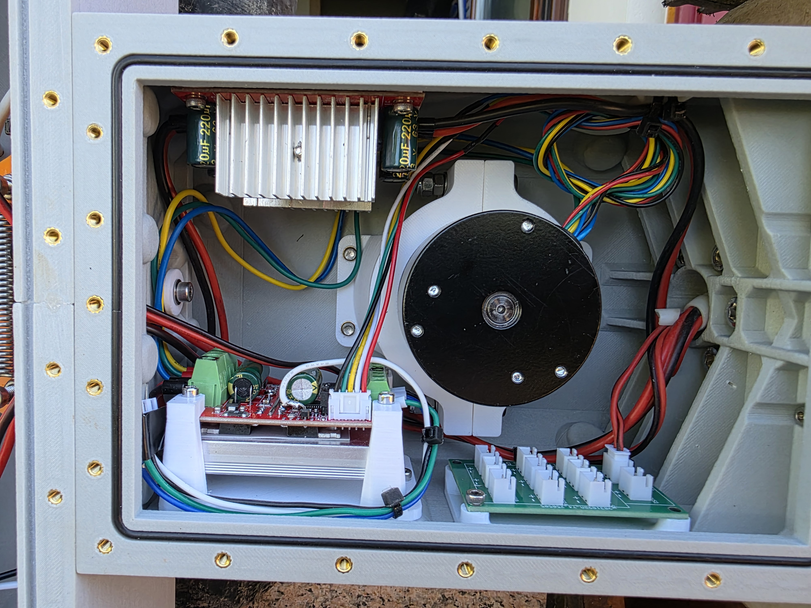

Lo Step-up va regolato a 30v utilizzando il trimmer contrassegnato come RV1 e regolato a 5A con il trimmer contrassegnato come RV2 prima di essere installato. Vanno anche allargati i 4 fori con una punta da 3.5. Poi si avvitano i distanziali allo step-up e lo si incolla nella scocca. Io per comodità lo avvito con solo con due viti così è più comodo se si deve togliere. La morsettiera con indicato IN+/IN- la si tiene verso la scocca posteriore. Allego anche foto dei collegamenti del driver.  

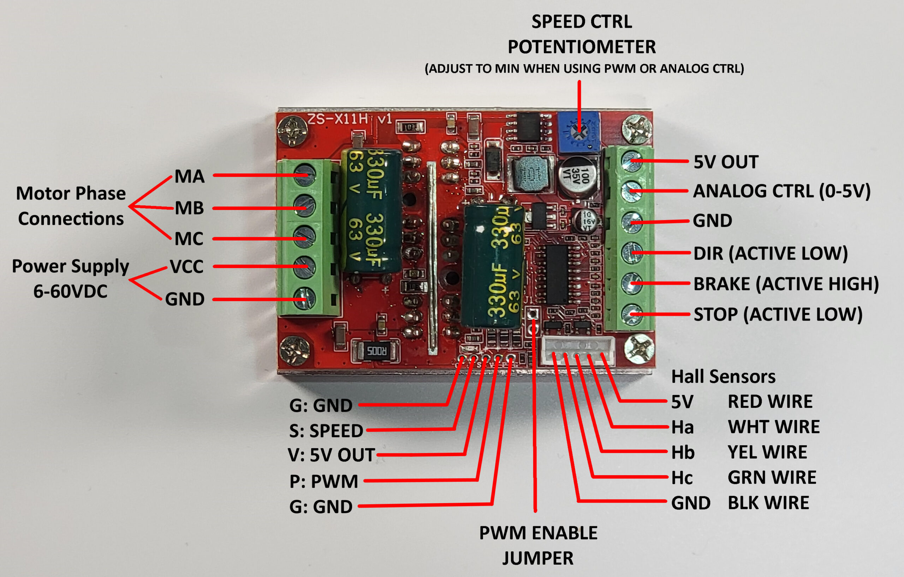

Una volta collegato il tutto si blocca il motore nel suo supporto e lo si fissa alla scocca come il vecchio motore (Il vecchio motore può essere montato anch'esso in questa versione perché le forature sono le stesse). A questo punto si mette il soffietto di protezione e lo si blocca con gli anelli in ABS.  

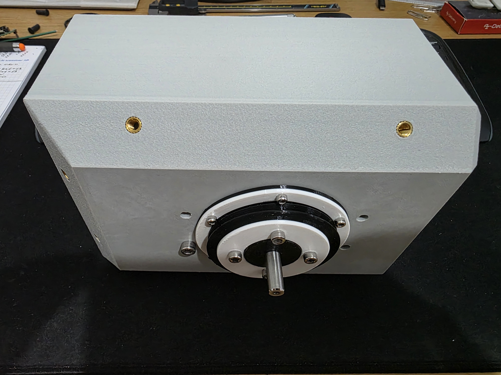

A questo punto quando tutto è montato e collegato non resta che montare il supporto del disco da taglio e relativo calettatore. Io ho fatto il supporto in alluminio e montato il calettatore commerciale in INOX ma ho creato anche il supporto in plastica al posto di quello in alluminio. Ho testato anche una versione totalmente in plastica per chi non volesse comprarsi un calettatore INOX, che comprende il supporto del disco da taglio ed il calettatore totalmente in PETG-CF con riempimento al 100%.  

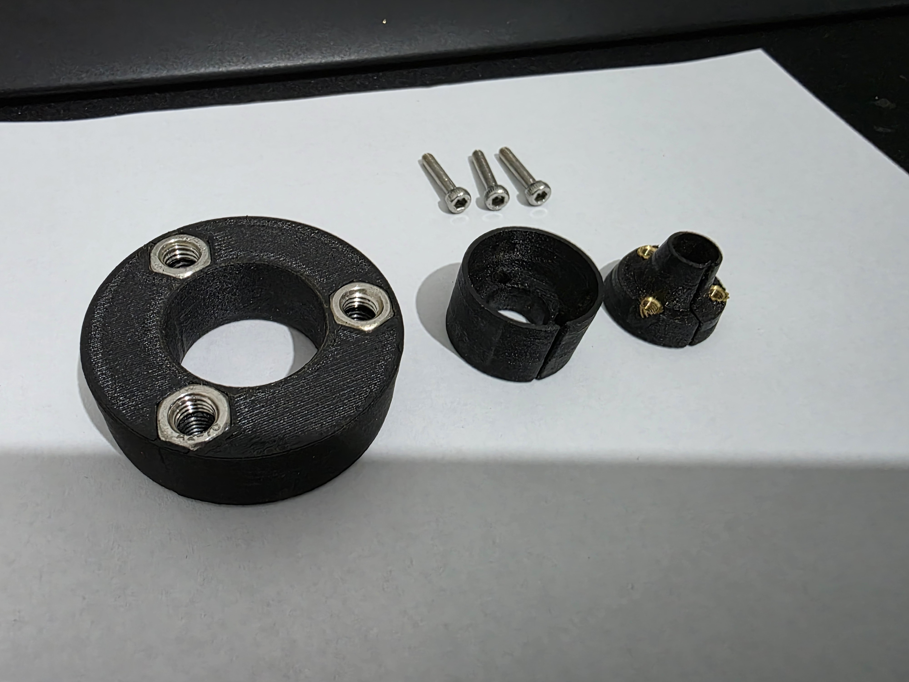

Per utilizza questa versione consiglio di inserire per prima la parte esterna del calettatore (quella con i 3 fori) nel supporto del disco da taglio inserendolo completamente,  

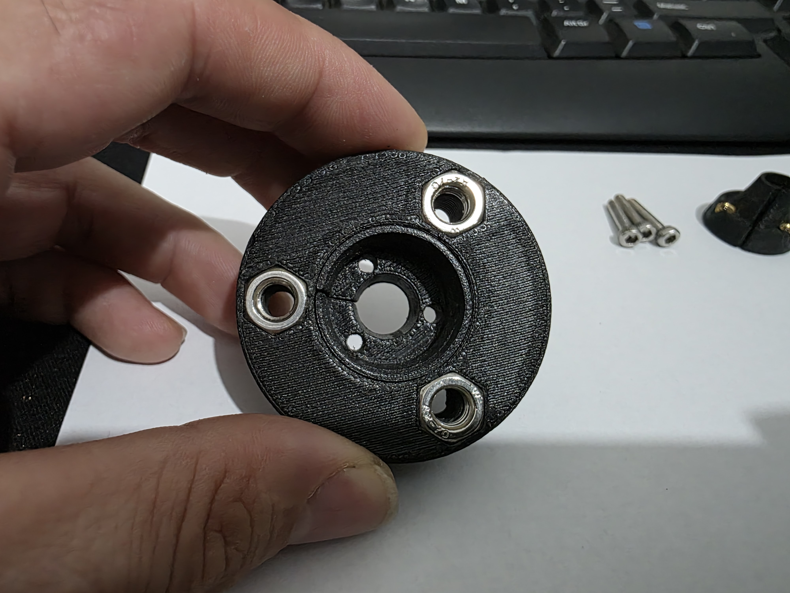

poi inserire la parte interna del calettatore con gli inserti filettati già montati cercando di non mettere la parte aperta in corrispondenza dell'altra.  

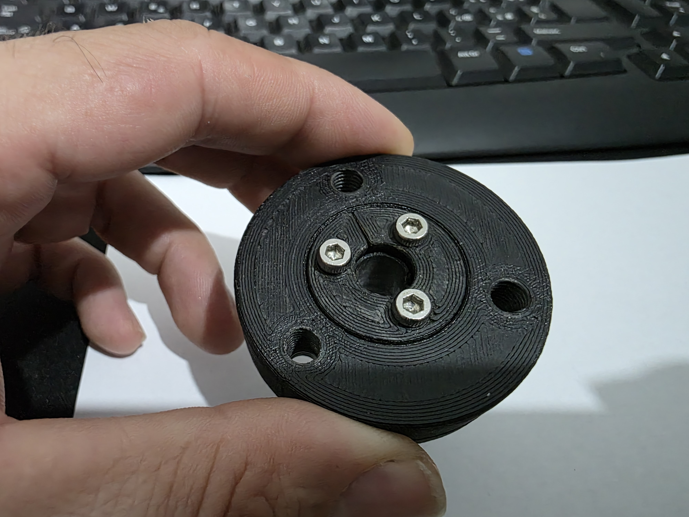

A questo punto lo inserite sull'albero del motore cercando di farlo stare a pari quando è completamente stretto. Man mano che si stringe lui andrà sempre più giù quindi partite da un pò più sporgenti. Mi raccomando di stringere le viti un pò per ciascuna altrimenti poi il disco gira storto. Io quando l'ho stretto abbastanza ho montato il piatto da taglio con le 3 viti cercando di non farle uscire dal lato opposto e facendolo girare a mano vedevo dove serviva stringere di più la vite. Questa operazione va fatta una volta sola poi quando si toglie il piatto di taglio per la manutenzione non serve togliere il resto dall'albero del motore.  

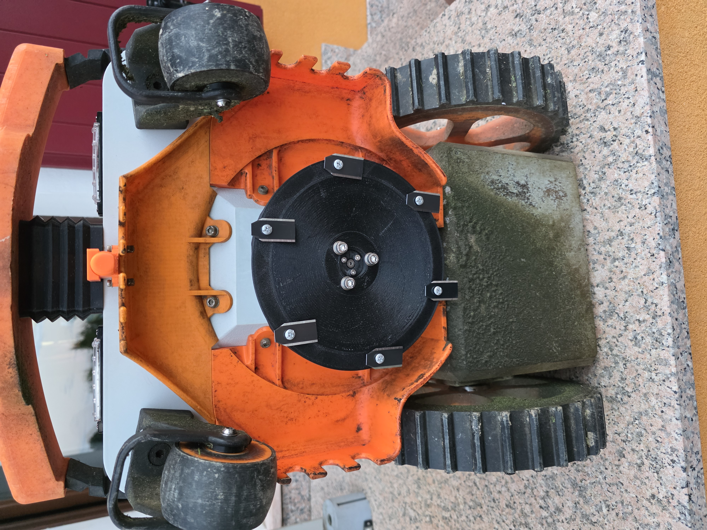

Con il calettatore commerciale non serve questa accortezza perché è autocentrante, ed inoltre ho creato un tappo di chiusura per proteggerlo perché con questo l'albero del motore è più interno e non a pari.  

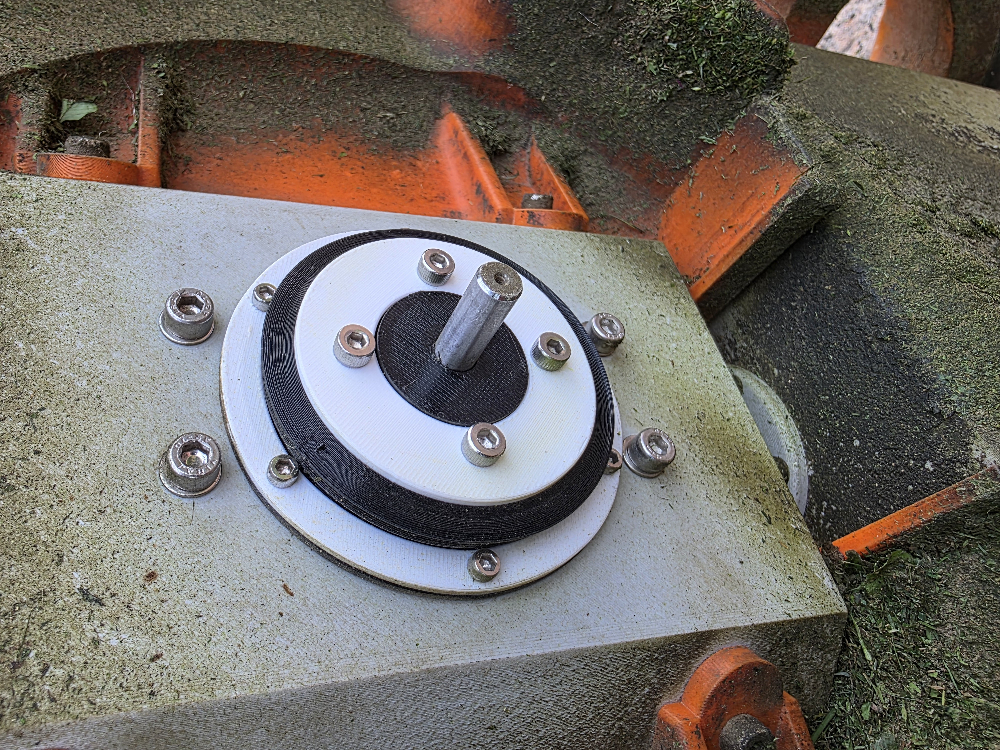  
  

---

## File di supporto

- [PDF per la costruzione dell'Albero Snodo MOD](https://makerworld.com/it/models/420276-arduino-robot-lawnmower-robot-tagliaerba-arduino#profileId-323001)
